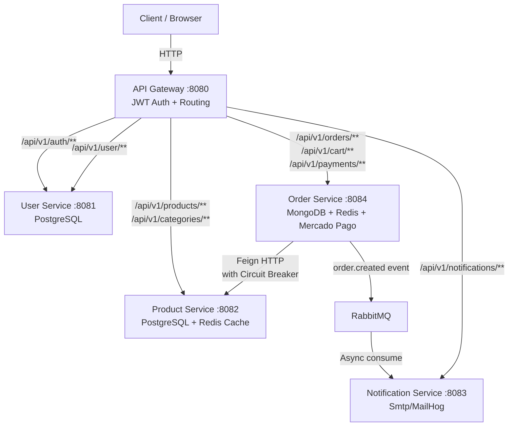

# 🛍️ E-commerce Microservices Platform

> **Status**: ✅ Production-Ready — Clean Architecture · DDD · TDD · CI/CD

A scalable, production-grade e-commerce backend built with a microservices architecture, focused on software engineering best practices: **Clean Architecture**, **Domain-Driven Design (DDD)**, **Test-Driven Development (TDD)**, and **Extreme Programming (XP)** principles.

---

## 🏗️ Architecture Overview



---

## 🚀 Technology Stack

| Category | Technology |
|----------|-----------|
| **Language** | Java 17 |
| **Framework** | Spring Boot 3.5.x, Spring Cloud |
| **API Gateway** | Spring Cloud Gateway (Reactive) |
| **Databases** | PostgreSQL 15, MongoDB 6 |
| **Cache** | Redis 7 (`@Cacheable` on product catalog) |
| **Messaging** | RabbitMQ 3.x |
| **Resilience** | Resilience4j (Circuit Breaker, Retry, TimeLimiter) |
| **Observability** | Spring Actuator, Micrometer, Prometheus |
| **API Docs** | SpringDoc OpenAPI 3 (Swagger UI) |
| **Security** | JWT (JJWT), Zero-Trust inter-service auth |
| **Testing** | JUnit 5, Mockito, Testcontainers |
| **CI/CD** | GitHub Actions, Docker Hub, AWS EC2 |
| **Infrastructure** | Docker, Docker Compose |
| **Payment** | Mercado Pago Checkout Pro |
| **Shipping** | Melhor Envio API |

---

## 📂 Project Structure

```
ecommerce-microservices/
├── api-gateway/          # JWT authentication & routing (Spring Cloud Gateway)
├── user-service/         # User registration, authentication, profile management
├── product-service/      # Product catalog, categories, stock control + Redis cache
├── order-service/        # Shopping cart (Redis), orders (MongoDB), payments, shipping
├── notification-service/ # Async email notifications via RabbitMQ + Thymeleaf
├── infrastructure/
│   └── docker/
│       ├── docker-compose.yml       # Local development environment
│       └── docker-compose.prod.yml  # Production deployment
├── docs/                 # Architecture docs, Kanban, Sprints
└── .github/workflows/    # CI (build+test) and CD (build+push+deploy) pipelines
```

Each service follows **Clean Architecture** with clear layer separation:

```
src/main/java/{package}/
├── domain/           # Entities, Value Objects, Repository interfaces, Domain exceptions
│                     # (No framework dependencies)
├── application/      # Use Cases, DTOs, Application Ports
│                     # (Pure Java, orchestrates domain)
├── infrastructure/   # JPA/MongoDB adapters, Feign clients, Redis cache, RabbitMQ
│                     # (Framework-specific implementations)
└── presentation/     # REST Controllers, Request/Response DTOs, Exception Handlers
                      # (HTTP layer only)
```

---

## 🔗 API Documentation (Swagger UI)

After starting each service, access its interactive API docs:

| Service | Swagger UI | API Docs |
|---------|-----------|----------|
| **User Service** | http://localhost:8081/swagger-ui.html | http://localhost:8081/api-docs |
| **Product Service** | http://localhost:8082/swagger-ui.html | http://localhost:8082/api-docs |
| **Order Service** | http://localhost:8084/swagger-ui.html | http://localhost:8084/api-docs |
| **Notification Service** | http://localhost:8083/swagger-ui.html | http://localhost:8083/api-docs |

---

## 📊 Observability

All services expose Spring Actuator endpoints:

| Endpoint | Description |
|----------|-------------|
| `/actuator/health` | Service health (includes DB, Redis, RabbitMQ, Circuit Breakers) |
| `/actuator/info` | Service metadata |
| `/actuator/metrics` | JVM, HTTP, cache metrics |
| `/actuator/prometheus` | Prometheus-format metrics for scraping |

**Circuit Breaker state** is visible in `/actuator/health` for the order-service (covers `productService` and `shippingService` instances).

**MailHog UI** (local email testing): http://localhost:8025

**RabbitMQ Management**: http://localhost:15672 (login: `guest`/`guest`)

---

## 🛠️ Getting Started

### Prerequisites
- **Docker Desktop** (for infrastructure containers)
- **Java 17+** (for running services)
- **Maven** (optional, `./mvnw` wrapper included)

### 1. Configure Environment

```bash
cp .env.dist .env
# Edit .env if needed (defaults work for local dev)
```

### 2. Start Infrastructure Services

```bash
docker-compose -f infrastructure/docker/docker-compose.yml up -d
```

This starts: **PostgreSQL**, **MongoDB**, **RabbitMQ**, **Redis**, and **MailHog** (email UI at http://localhost:8025).

### 3. Run Each Service

Open a terminal per service (or use your IDE):

```bash
# Terminal 1
cd user-service && ./mvnw spring-boot:run

# Terminal 2
cd product-service && ./mvnw spring-boot:run

# Terminal 3
cd order-service && ./mvnw spring-boot:run

# Terminal 4
cd notification-service && ./mvnw spring-boot:run

# Terminal 5 — start last (depends on all others)
cd api-gateway && ./mvnw spring-boot:run
```

### 4. Verify Health

```bash
curl http://localhost:8080/actuator/health   # Gateway
curl http://localhost:8081/actuator/health   # User Service
curl http://localhost:8082/actuator/health   # Product Service
curl http://localhost:8084/actuator/health   # Order Service
curl http://localhost:8083/actuator/health   # Notification Service
```

---

## 🧪 Running Tests

### Unit Tests
```bash
# Per service
cd <service-name>
./mvnw clean test
```

### Integration Tests (requires Docker)
```bash
# Per service — Testcontainers spins up real databases
cd <service-name>
./mvnw clean verify
```

### All Services
```bash
for service in api-gateway user-service product-service order-service notification-service; do
  cd $service && ./mvnw clean verify && cd ..
done
```

---

## 🚀 Production Deployment (AWS EC2 / CI/CD)

The CI/CD pipeline in `.github/workflows/cd.yml` automatically:
1. Builds Docker images for all services
2. Pushes to Docker Hub on every push to `main`
3. SSHs into EC2 and deploys via `docker-compose.prod.yml`

**Required GitHub Secrets:**

| Secret | Description |
|--------|-------------|
| `DOCKERHUB_USERNAME` | Docker Hub username |
| `DOCKERHUB_TOKEN` | Docker Hub access token |
| `EC2_HOST` | EC2 public IP |
| `EC2_USER` | EC2 SSH username (`ubuntu`) |
| `EC2_SSH_KEY` | EC2 private key (PEM) |
| `JWT_SECRET` | JWT signing secret (strong random) |
| `POSTGRES_USER` | Database username |
| `POSTGRES_PASSWORD` | Database password |
| `RABBITMQ_USER` | RabbitMQ username |
| `RABBITMQ_PASSWORD` | RabbitMQ password |
| `SMTP_HOST` | Production SMTP host |
| `SMTP_PORT` | Production SMTP port |
| `SMTP_USERNAME` | SMTP username |
| `SMTP_PASSWORD` | SMTP password |

---

## 📚 Documentation

- [📋 Kanban Board](docs/KANBAN.md) — Sprint progress and backlog
- [🗓️ Sprints Roadmap](docs/SPRINTS.md) — Iterative delivery roadmap
- [📝 Architecture Plan](docs/ECOMMERCE_IMPLEMENTATION_PLAN.md) — Detailed architecture guide

---

## 🤝 Contributing & Git Flow

This project follows **Gitflow**:
- `main` — Production (triggers CI/CD to Docker Hub + EC2)
- `develop` — Integration branch for ongoing development
- `feature/*` — Feature branches merged into `develop`

---

*Developed by **Lucas** — [Clean Architecture · DDD · XP]*