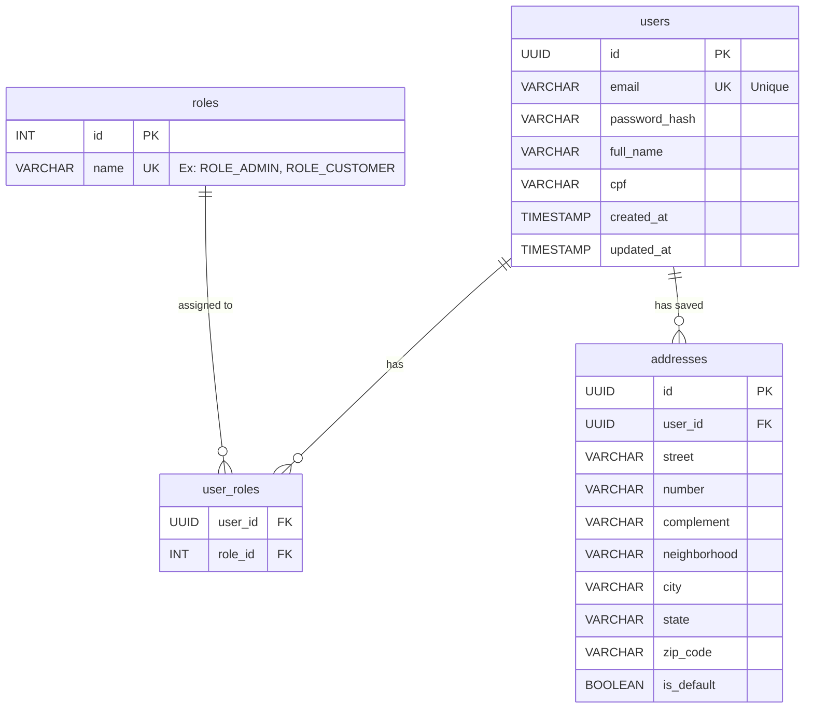
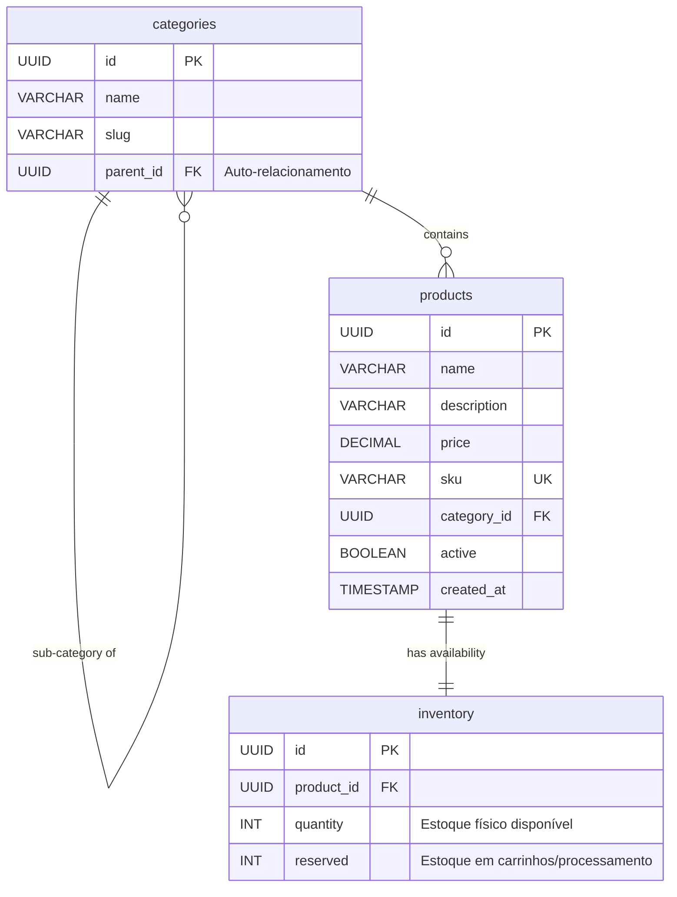
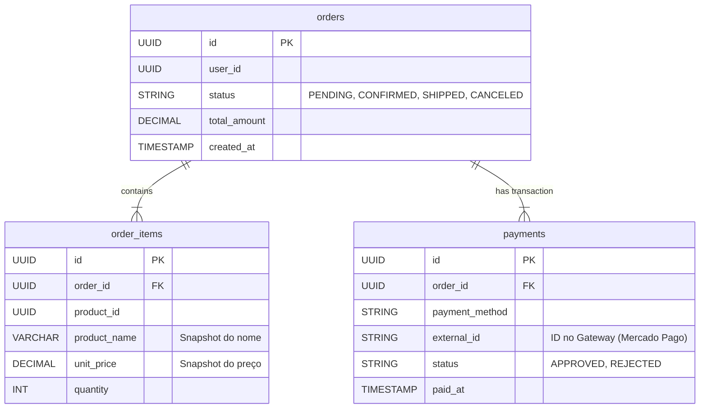

# 🗄️ Database Schemas (PostgreSQL)

Documentação dos esquemas relacionais dos microserviços.

---

## 1. User Service
**Responsabilidade**: Gestão de identidades, autenticação e perfis.

---

## 2. Product Service (Write Model)
**Responsabilidade**: Fonte da verdade dos dados de produtos e controle de estoque transacional.
*Nota*: A leitura tunada pode ser feita via MongoDB (CQRS), mas o Postgres guarda a consistência.

---

## 3. Order Service
**Responsabilidade**: Orquestração de compras e pagamentos.

