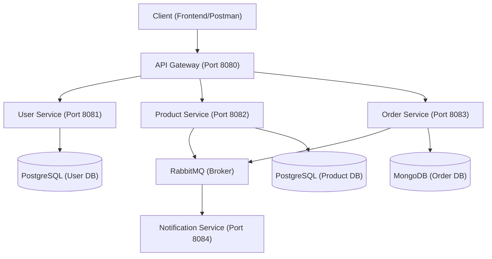

# 🛍️ Onboarding Guide: E-commerce Microservices

Welcome to the **E-commerce Microservices** project! This guide will help you understand the project's vision, architecture, and how to get up and running as quickly as possible.

---

## 🏗️ 1. Project Vision & Architecture

This project is a scalable, cloud-native e-commerce system built using a microservices architecture. It focuses on **Clean Architecture**, **Domain-Driven Design (DDD)**, and **Extreme Programming (XP)** principles to ensure high maintainability and scalability.

### Architecture Overview



### Key Technologies
- **Java 17 & Spring Boot 3**: Core backend stack.
- **Microservices**: Decoupled services communicating via REST and asynchronous events.
- **Databases**:
  - **PostgreSQL**: Used for relational data (Users, Products).
  - **MongoDB**: Used for flexible document-based data (Orders).
- **Messaging**: **RabbitMQ** for event-driven flows (Order Created -> Send Email).
- **Infrastructure**: **Docker & Docker Compose** for local orchestration.
- **Documentation**: **Swagger/OpenAPI** for API exploration.

---

## 📂 2. Repository Structure

This is a **monorepo** containing all services and documentation.

```bash
ecommerce-microservices/
├── api-gateway/        # Routing, Security, Rate Limiting
├── user-service/       # Identity, JWT Auth, User Management
├── product-service/    # Catalog, Pricing, Inventory
├── order-service/      # Checkout, Order History, Status Management
├── notification-service/ # Email/SMS dispatching (Event Consumer)
├── infrastructure/     # Docker configuration and environment scripts
└── docs/               # Technical docs, Kanban, and Methodologies
```

### Internal Microservice Structure (Clean Architecture)
Each service follows the same layering to decouple business logic from infrastructure:
- **`domain/`**: Pure business logic (Entities, Value Objects, Repository Interfaces). No external dependencies.
- **`application/`**: Use cases and DTOs. Orchestrates the flow of data.
- **`presentation/`**: REST controllers and request/response mappers.
- **`infrastructure/`**: Database implementations (JPA/Mongo), RabbitMQ producers/consumers, Security configs.

---

## 🚀 3. Local Setup & Running

### Prerequisites
- [Docker & Docker Compose](https://www.docker.com/) (Essential for infra)
- [Java 17+](https://adoptium.net/)
- [Postman](https://www.postman.com/) or [Insomnia](https://insomnia.rest/) (To test APIs)

### Step 1: Fire up the Infrastructure
All required databases and message brokers are dockerized. Run them first:
```bash
docker-compose -f infrastructure/docker/docker-compose.yml up -d
```
*This starts: PostgreSQL (User/Product DBs), MongoDB (Order DB), and RabbitMQ.*

### Step 2: Running a Service
Navigate to any service directory and use the Maven wrapper:
```bash
cd user-service
./mvnw spring-boot:run
```

### Step 3: Accessing APIs
- **Swagger UI**: Visit `http://localhost:8081/swagger-ui.html` (e.g., for user-service) to see the API documentation.
- **Gateway**: All calls should eventually go through `http://localhost:8080/`.

---

## 🛠️ 4. Engineering Standards & Workflow

We are an **XP (Extreme Programming)** team. We prioritize quality over speed by following these strict practices:

### TDD (Test-Driven Development)
We follow the **Red-Green-Refactor** cycle:
1. **Red**: Write a failing unit or integration test.
2. **Green**: Write the minimum code to pass the test.
3. **Refactor**: Clean up the code without breaking functionality.

### SOLID & Design Patterns
- **S**ingle Responsibility: No fat controllers or bloated services.
- **D**ependency Inversion: Application layer depends on interfaces, not implementations.
- **Patterns**: We proactively use **Strategy**, **Factory**, **Observer**, and **Mapper** patterns where appropriate.

### Gitflow Workflow
1. `feat/feature-name` branch from `develop`.
2. Commit often with descriptive messages.
3. Open a PR to `develop` once tests are passing.
4. Merge to `main` only for releases.

---

## 📚 5. Helpful Documentation

Refer to the `docs/` folder for deeper technical details:
- [XP_METHODOLOGY.md](docs/XP_METHODOLOGY.md): Our coding philosophy.
- [DATABASE_SCHEMA.md](docs/DATABASE_SCHEMA.md): Data models and relationships.
- [KANBAN.md](docs/KANBAN.md): Current tasks and progress.
- [SPRINTS.md](docs/SPRINTS.md): The roadmap.

---

> **Tip**: If you're stuck, check the logs of the running containers using `docker-compose logs -f`. Happy coding!

